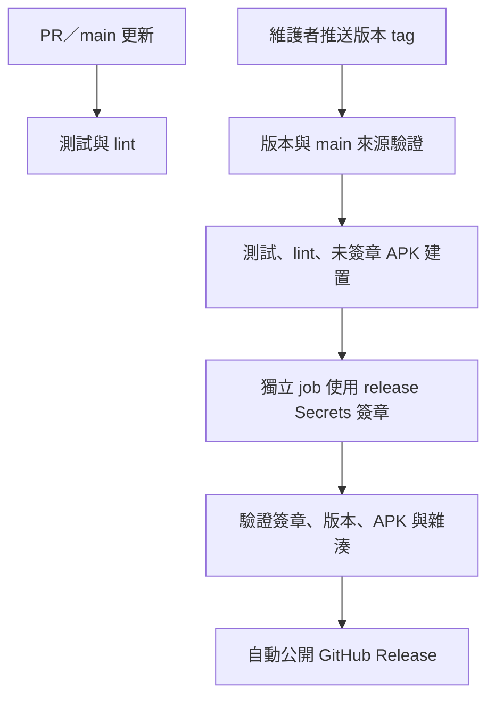

# 自編譯與發布流程

[使用手冊](../README.md) · [技術文件](technical-guide.md) · [維護慣例](maintenance.md)

## 採用的流程

正式 repository 為 `clspeter/boox-cover-sync`。平常 push／PR 只執行測試與 lint；準備提供 APK 下載時更新版本並推送 `vX.Y.Z` tag，自動編譯、簽章與公開 GitHub Release。沒有人工批准或強制實機驗收關卡。

必要檢查失敗即停止發布。可以先建立內部草稿收齊附件，再由同次 workflow 自動公開，不等待人工驗收。一般 CI 測試仍會編譯必要程式碼，但不打包正式 APK。

## 版本與發布物

`version.properties` 是版本資訊來源，Gradle 與發布檢查共用。tag 必須符合 `vX.Y.Z`，並與 APK versionName 一致；versionCode 必須為正整數且後續發布遞增，不使用 CI run number 代替。

公開後不移動 tag、不覆蓋既有 APK。修正另發新版；回退功能時可回復程式碼，但 versionCode 仍應提高。不要把卸載或 `adb install -d` 當成一般更新流程。

發布提供正式簽章 APK 與 SHA-256，並記錄版本、commit、CI run 與簽章憑證指紋。更新說明不放私人閱讀紀錄或裝置識別資料。編譯通過不代表所有 BOOX 韌體皆相容，說明只能列實際測過的相容性。

## 簽章保管

使用專用正式 keystore，不沿用 debug key。GitHub 的 `release` Environment 保存：

| Secret | 用途 |
| --- | --- |
| `ANDROID_KEYSTORE_BASE64` | keystore 的 Base64 內容；Base64 本身不是加密 |
| `ANDROID_KEYSTORE_PASSWORD` | keystore 密碼 |
| `ANDROID_KEY_ALIAS` | 簽章金鑰名稱 |
| `ANDROID_KEY_PASSWORD` | 簽章金鑰密碼 |

正式簽章憑證 SHA-256 以非機密 Environment variable 固定，workflow 比對指紋避免意外換 key。缺少必要設定就失敗，不退回 debug signing。

金鑰只供簽章 job 使用，建置與測試不提供 Secrets。簽章 job 不執行 repository 的 Gradle，僅處理同一次 workflow 的產物。先 `zipalign` 再 `apksigner`，簽完不修改 APK。金鑰暫存在 runner temporary directory，結束時清除，不保存至 cache、log 或 artifact。

keystore 與本機密碼設定已列入 `.gitignore`。另存加密離線備份並分開保管密碼；GitHub Secrets 不能作為可下載還原的備份。正式 key 遺失或外洩時，需規劃 Android 更新遷移，不能任意換 key。

公開專案的相關做法見[簽章案例](android-signing-examples.md)，其中 Organic Maps 有明確的 Environment Secrets 範例。

## Workflow 與遠端保護

| 保護 | 用途 |
| --- | --- |
| Actions token 預設唯讀 | 僅發布 job 提升為 Release 寫入權限 |
| `release` Environment 限定 `v*` tag | 一般 PR／branch 不能取得正式簽章 Secrets |
| main 走 PR 並通過 CI | 單人維護不要求第二人批准 |
| main 禁止 force push／刪除 | 保留已公開歷史 |
| 版本 tag 只准管理者建立，禁止更新／刪除 | 固定版本來源 commit |
| CODEOWNERS | 標示 workflow、版本、建置與簽章程式的負責人 |
| actions 固定完整 SHA | 避免第三方可移動標籤悄悄更換執行內容 |

CODEOWNERS 本身不是存取控制。擁有管理權限的人可以修改遠端保護，能控制可信 workflow 的人仍可能使用簽章金鑰。帳號應啟用 passkey 或雙因素驗證。

不使用 `pull_request_target` 執行外部 PR 程式碼，不自動合併相依套件更新。main、tag 與 Environment 保護須在 GitHub 設定，僅提交 YAML 不會建立這些規則。

## 第一次正式安裝

目前 BOOX 上使用本機 debug key。正式版保留 `tw.mustp.booxcoversync` 並使用新 key，無法直接覆蓋既有測試版。初次遷移須保存必要設定、另行處理舊版並重新授權；workflow 不會卸載裝置上的 App。

之後正式版本固定 package 與 key，才能正常覆蓋更新。debug package 分離屬後續工作，目前未完成；不要同時讓兩個版本改寫 BOOX 封面。

## 部署狀態（2026-09-17）

- 已建立公開 repo `clspeter/boox-cover-sync`。
- 已設定 `release` Environment 僅接受 `v*` tag，Actions 預設唯讀，禁止 workflow 批准 PR。
- 已啟用版本 tag 的建立權限與禁止更新／刪除規則。
- 本機流程與 main 保護的部署驗證仍在進行；尚未建立或上傳正式 key，尚未發布正式 APK。

先前本機執行 `:app:testReleaseUnitTest :app:lintRelease :app:assembleRelease` 成功：80 個單元測試通過，lint 0 errors／30 warnings。產物 `app/build/outputs/apk/release/app-release-unsigned.apk` 尚未簽章，不能直接安裝；這不等於 GitHub 簽章發布已驗證。
